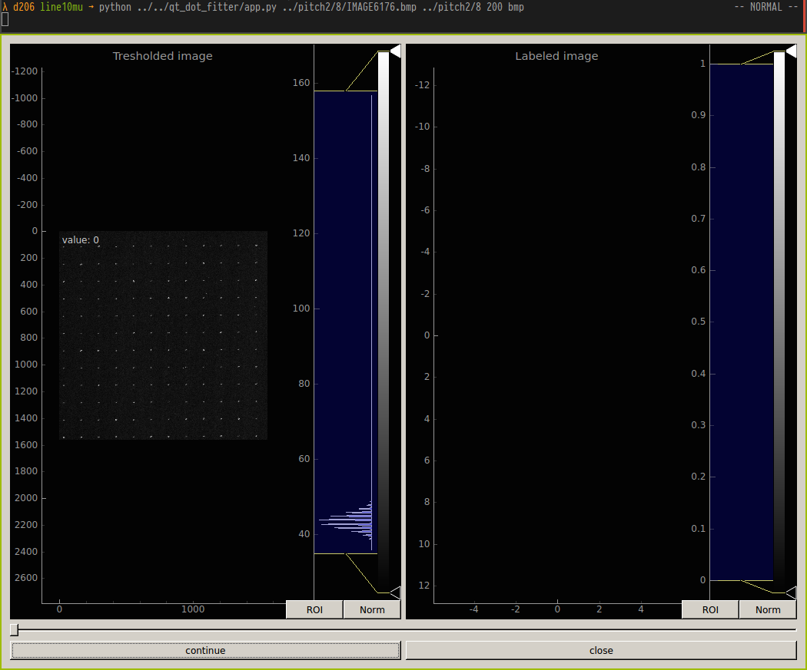

qt_dot_fitter
=============

Qt and pyton GUI to measure statistics on SEM images(image files, bundled with the .ssc meta data from ZEISS SEMs) of circular objects.

=============

# usage:

run the main app, app.py with :

```bash
python /qt_dot_fitter/app.py ./path_to_/a_reference_image.bmp ./root_foolder_with pictures min_size format
```

where *min_size* is a gray number that limits the smallest possible are fitted by the app;
there is no general rule, it must be found out iteratively.

*format* is the format of the images on the hard disk.

there is an hidden last argument if working remotely and want to draw the GUI remotely and not over tunneled X11.

The output of the fitted measurements is saved on the disk as .csv file for every image.
oUse the helper functions in stat.py to parse the results and produce meaningful plots.
# Screen shots

Main GUI when opening the image 

Image is labeled  connecting regions of an integer array. 
Two pixels are connected when they are neighbors and have the same value. They can be neighbors either in a 4- or 8-connected sense:
```
4-connectivity      8-connectivity

     [ ]           [ ]  [ ]  [ ]
      |               \  |  /
[ ]--[ ]--[ ]      [ ]--[ ]--[ ]
      |               /  |  \
     [ ]           [ ]  [ ]  [ ]
```

